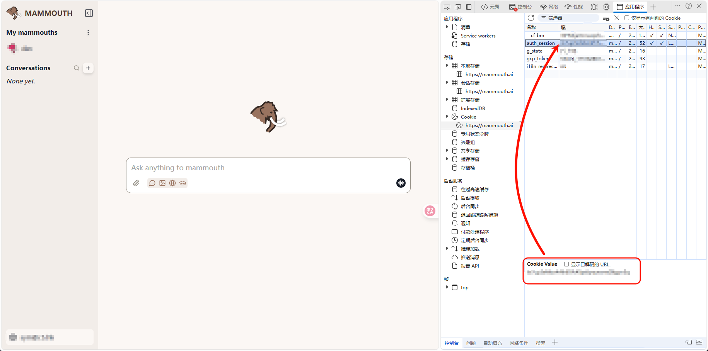

<div align="center">

# 🚀 Mammouth API 代理服务

[](https://github.com/rfym21/mammouth-proxy)
[](https://hub.docker.com/r/rfym21/mammouth-proxy)

*一个强大的 API 代理服务，将 OpenAI 格式请求转发到 Mammouth AI 平台*

**🔗 [交流群](https://t.me/nodejs_project) | 🐳 [Docker Hub](https://hub.docker.com/r/rfym21/mammouth-proxy)**

</div>

## ✨ 功能特点

<div align="center">

| 功能 | 状态 | 描述 |
|------|------|------|
| 🔄 **OpenAI 兼容接口** | ✅ | 接收标准 OpenAI 格式的 API 请求 |
| 🚀 **多模型支持** | ✅ | 支持 Claude、Grok、Gemini 和 GPT-4o-mini 等多种模型 |
| 🌊 **流式响应** | ✅ | 支持 SSE 格式的流式响应处理与转发 |
| 🔑 **API 认证** | ✅ | 内置 API 密钥验证机制 |
| 🔄 **账号轮换** | ✅ | 自动在多个账号间轮换，解决使用限制问题 |
| 🛡️ **错误处理** | ✅ | 优化的错误处理机制，提供友好错误消息 |

</div>

---

## 🤖 支持的模型

<div align="center">

| 🏷️ OpenAI 格式模型名称 | 📊 Mammouth 平台对应模型 | 📈 稳定性 |
|-----------|-------------|---------|
| 🔮 `claude-sonnet-4-20250514` | `anthropic-claude-4-2025-05-14` | 高 |
| 🤖 `gpt-4o-mini` | `openai-gpt-4o-mini` | 中 |
| 🤖 `o4-mini` | `openai-o4-mini` | 中 |
| 🧠 `gemini-2.5-pro-preview-05-06` | `google-gemini-2.5-pro` | 高 |
| 🚀 `grok-3` | `xai-grok-3-beta` | 低 |

</div>

---

## 🚀 快速开始

### 方式一：🐳 Docker Compose（推荐）

#### ⚙️ **Step 1**: 创建 docker-compose.yml

```yaml
services:
  mammouth-proxy:
    image: rfym21/mammouth-proxy:latest
    container_name: mammouth-proxy
    restart: always
    ports:
      - "3000:3000"
    environment:
      - COOKIES=your_cookies_here  # 填入 Mammouth 账号的 Cookie，多个账号用逗号分隔
      - AUTH_TOKEN=your_auth_token_here  # 设置 API 认证密钥
```

#### 🚀 **Step 2**: 启动服务

```bash
docker-compose up -d
```

---

### 方式二：🐳 Docker CLI

```bash
docker run -d \
  --name mammouth-proxy \
  -p 3000:3000 \
  -e COOKIES=your_cookies_here \
  -e AUTH_TOKEN=your_auth_token_here \
  rfym21/mammouth-proxy:latest
```

---

### 方式三：💻 本地开发

#### 📥 **Step 1**: 克隆仓库

```bash
git clone https://github.com/rfym21/mammouth-proxy.git
cd mammouth-proxy
```

#### 📦 **Step 2**: 安装依赖

```bash
npm install
```

#### 📝 **Step 3**: 环境配置

创建 `.env` 文件：

```env
PORT=3000
COOKIES=your_mammouth_cookies_here
AUTH_TOKEN=your_auth_token_here
```

#### 🏃 **Step 4**: 启动服务

```bash
npm start
```

---

## ⚙️ 配置说明

### 环境变量

| 变量名 | 说明 | 示例 |
|--------|------|------|
| COOKIES | Mammouth 账号 Cookie，多个账号用逗号分隔 | cookie1,cookie2,cookie3 |
| AUTH_TOKEN | API 认证密钥 | sk-your-auth-token |
| PORT | 服务端口(可选，默认 3000) | 3000 |

---

## 🔍 Cookie 获取方法

1. 登录 Mammouth 平台 (<https://mammouth.ai>)
2. 打开浏览器开发者工具 (F12) 并切换到"应用"或"存储"选项卡
3. 在 Cookies 中找到 `auth_session` 的值
4. 复制该值并设置为环境变量



<div align="center">

## 💬 交流与支持

[](https://t.me/nodejs_project)

</div>
